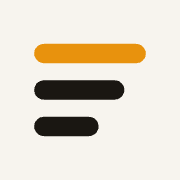
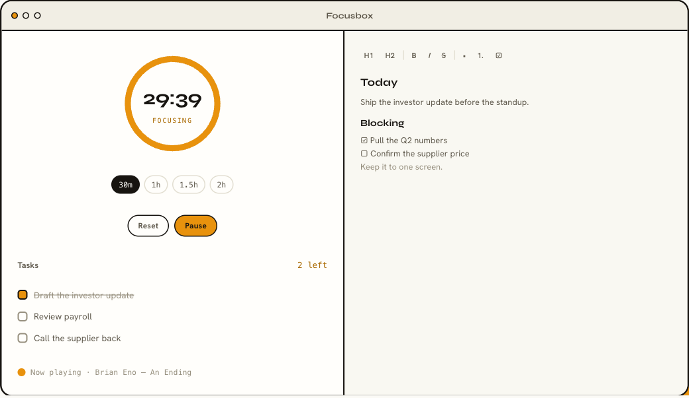

<div align="center">



# focusbox

**A timer. A list. A notepad. That's the whole app.**

[](https://github.com/mathiasthu/focusbox/releases/latest)
[](https://github.com/mathiasthu/focusbox/releases)
[](https://github.com/mathiasthu/focusbox/releases/latest)
[](#license)

[**Website**](https://focusbox.net) · [**Try it in your browser**](https://app.focusbox.net) · [**Download**](https://github.com/mathiasthu/focusbox/releases/latest) · [**Support ♥**](https://buy.stripe.com/00w7sNcd1aCY6lEazB6g80O)



</div>

Focusbox is a deliberately small focus app. A countdown to work against, a task
list you check off, and a notes page that's always open beside them. It runs on
your own computer, saves everything locally, and never tracks or scores you.
I built it after [Rize started doing too much](https://focusbox.net/focusbox-vs-rize).

## It does three things

- **A timer that winds down** — set 30m / 1h / 1.5h / 2h (or add +5 to +30 when
  it's up). The ring empties as time runs out, then pulses quietly. No sound,
  no log, no score.
- **A list you check off** — type a task, press enter, tick it when it's done.
  The header counts what's left.
- **Notes beside it** — one clean document with headings, bold/italic/strike,
  lists, and checklists. Toolbar or Markdown shortcuts (`# `, `- `, `1. `, `[ ] `).

Plus the quiet extras: light & dark themes, a handful of accent colors, a
macOS menubar countdown, an optional Spotify mini-player (macOS), and instant
local autosave.

## Download

**[Grab the latest release →](https://github.com/mathiasthu/focusbox/releases/latest)**

| Platform | File | First launch |
|---|---|---|
| **macOS** (Apple Silicon) | `Focusbox_*_aarch64.dmg` | Right-click the app → **Open** (it isn't notarized yet), or `xattr -cr /Applications/Focusbox.app` once |
| **Windows 11** | `Focusbox_*_x64-setup.exe` | SmartScreen may warn — **More info → Run anyway** (unsigned, not unsafe) |

Or skip installing and [use it in your browser](https://app.focusbox.net).

## Private by default, synced if you want

- **Local-first** — no account, nothing leaves your machine. Your tasks and
  notes live in a single file on your own disk.
- **Nothing watching** — no analytics, no telemetry, no productivity grades.
- **Optional sync** — $2/mo (or $20/yr) keeps your devices in step,
  **end-to-end encrypted**: the server only ever stores encrypted blobs and
  never sees your password or keys. Turn it on in the app under
  **Settings → Account**. The app is fully usable without it, forever.

## Built with

[Tauri 2](https://tauri.app) (Rust) · [React](https://react.dev) +
TypeScript + [Vite](https://vitejs.dev) · [TipTap](https://tiptap.dev) for the
editor. One codebase builds the macOS app, the Windows app, and the web app.

## Develop / build from source

Requires [Node.js](https://nodejs.org), the [Rust toolchain](https://rustup.rs),
and platform build tools (Xcode Command Line Tools on macOS; MSVC + WebView2 on
Windows).

```bash
npm install
npm run tauri dev      # run with hot reload
npm run tauri build    # build the installable app for your OS
```

Both installers are produced in CI on every `v*` tag — see
[`.github/workflows/build-apps.yml`](.github/workflows/build-apps.yml).

## Support

Focusbox is free to use and its code is public. If it helps you focus, you can
[**support its development**](https://buy.stripe.com/00w7sNcd1aCY6lEazB6g80O) —
entirely optional, always appreciated. ♥

## License

Focusbox is **source-available** under the
[Focusbox Community License](LICENSE):

- **Use it free** — personal use and internal company use cost nothing, forever.
- **Build it yourself** — read the code, modify it, compile your own copy,
  share it for free.
- **Selling it needs a license** — commercially distributing Focusbox or any
  rebranded/white-label version of it requires a commercial agreement.
  Contact **info@focusbox.net**.

Releases up to and including v0.2.11 were published under MIT and remain
MIT-licensed.
